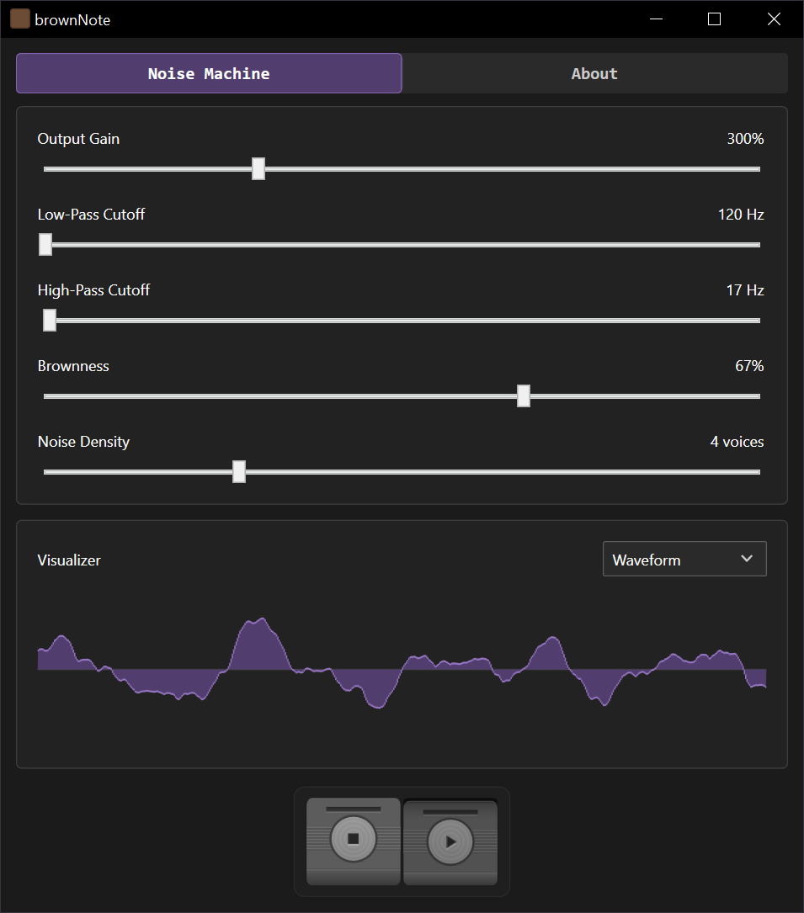
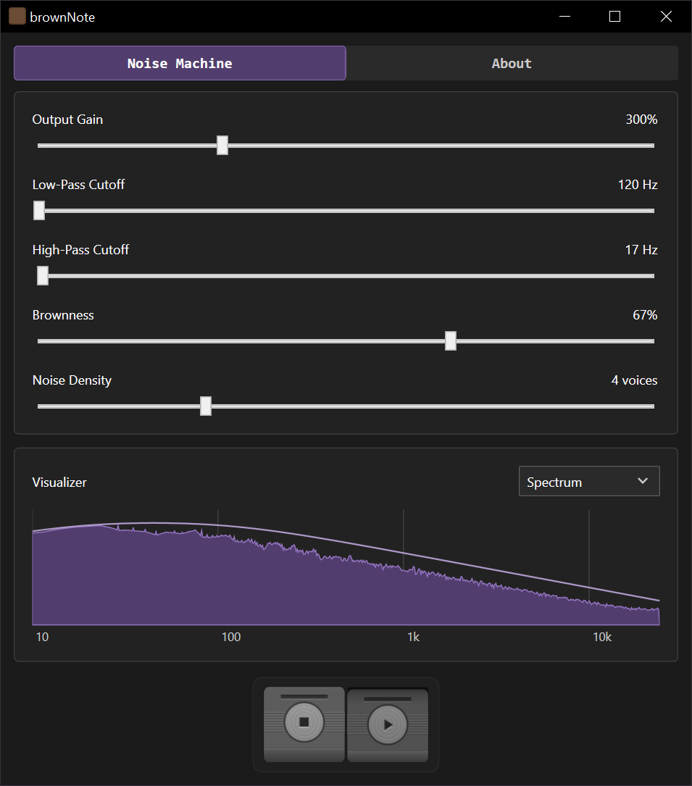
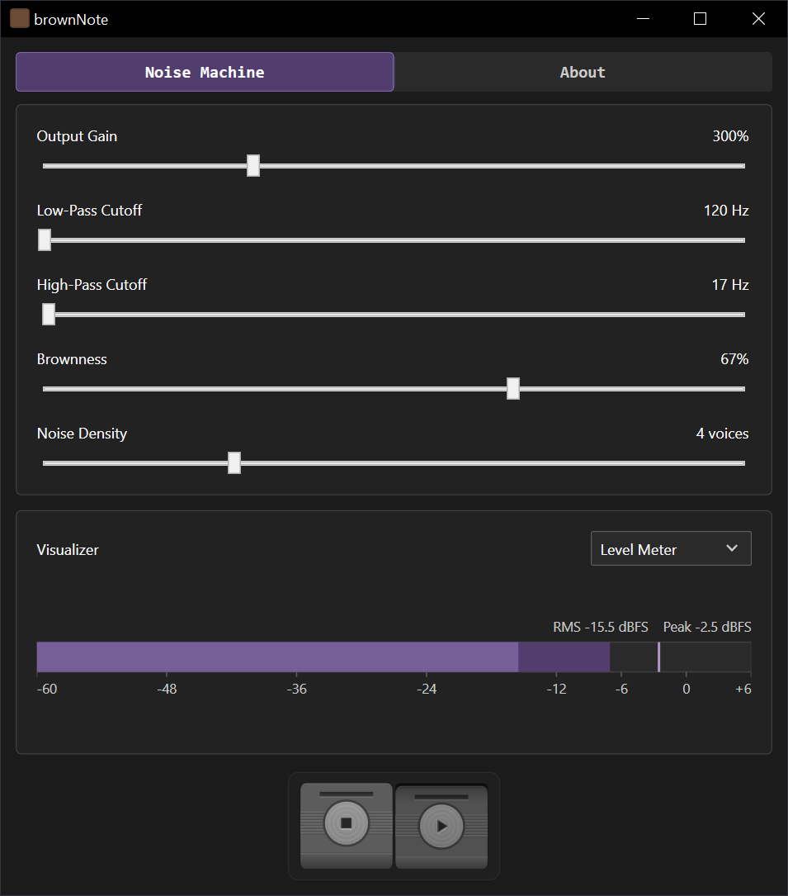

# brownNote

Brown noise machine app. Windows only. C# .NET 10 WPF

<!-- Quick Reference -->
<table border="0">
<tbody>
<tr>
<td valign="top"></td>
<td valign="top"></td>
</tr>
</tbody>
</table>
<!-- End Quick Reference -->

## Visualizer Modes

| <h3>Waveform</h3> |
|:---:|
|  |

| <h3>Spectrum</h3> |
|:---:|
|  |

| <h3>Level Meter</h3> |
|:---:|
|  |

## Info and Links 

Simple explanation of colored noise : https://www.nm.org/healthbeat/healthy-tips/what-noise-color-is-best-for-sleep