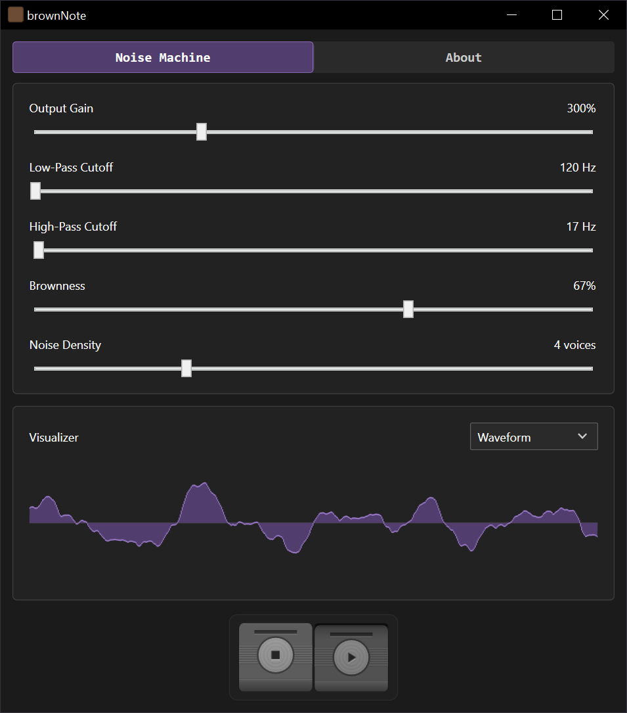
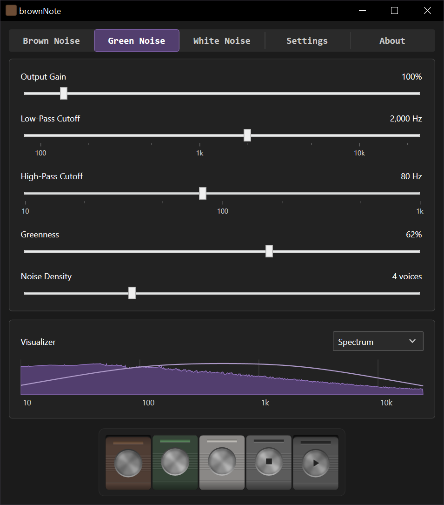
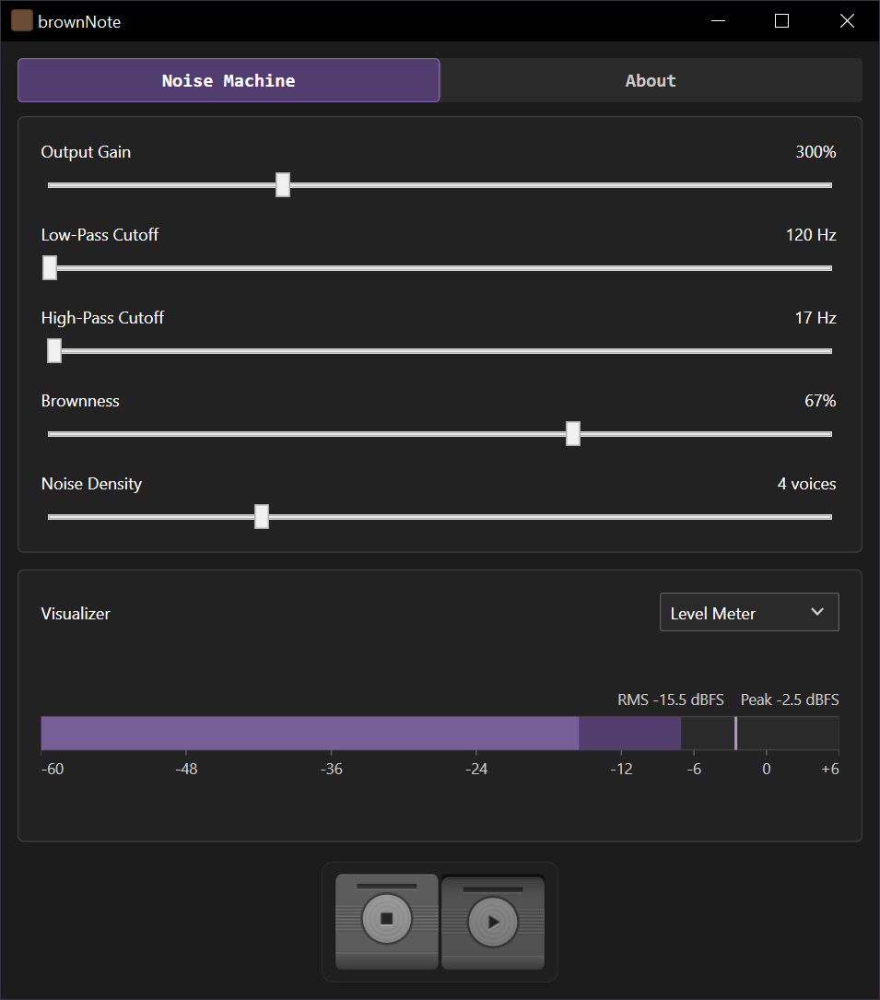

# brownNote

Brown noise machine app. Windows only. C# .NET 10 WPF

<!-- Quick Reference -->
<table border="0">
<tbody>
<tr>
<td valign="top"></td>
<td valign="top"></td>
</tr>
<tr>
<td valign="top"></td>
<td valign="top"></td>
</tr>
</tbody>
</table>
<!-- End Quick Reference -->

## Noise Machine Tabs

| <h3>Brown</h3> |
|:---:|
|  |

| <h3>Green</h3> |
|:---:|
|  |

| <h3>White</h3> |
|:---:|
|  |

## Info and Links 

Simple explanation of colored noise : https://www.nm.org/healthbeat/healthy-tips/what-noise-color-is-best-for-sleep

## Requirements

- .NET 10 SDK
- PowerShell 7
- Inno Setup 6 for installers
- GitHub CLI for release scripts
- ImageMagick (`magick`) for installer icon helpers

## Versioning

- Semantic version: `.version/version`
- Optional release tag override: `.version/versionTag`
- Last build platform: `.version/versionBuild`
- User release notes: `buildNotes.txt` (local, not committed)
- Agent history: `buildNotes.md` (local, not committed)

## Agent Docs

Built on [base](https://github.com/fosterbarnes/base).

- [AGENTS.md](AGENTS.md): agent rules and project guidelines
- [STYLE.md](src/.md/STYLE.md): file, code, docs, and design style
- [SCRIPTS.md](src/.md/SCRIPTS.md): PowerShell script guide
- [THEMING.md](src/.md/THEMING.md): colors and theming
- [IMPORT.md](src/.md/IMPORT.md): sync shared guidance from `base`
- [DEPENDENCIES.md](src/.md/DEPENDENCIES.md): tools and packages
